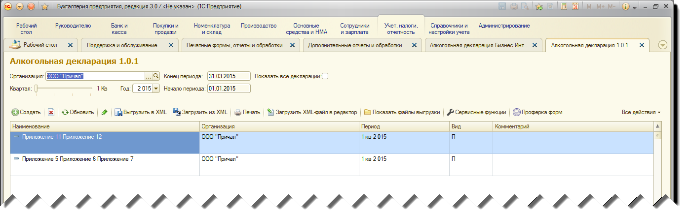

Обзор базовых концепций продукта
================================

Журнал отчетов
--------------

Журнал отчетов доступен в двух реализациях. Первая (рекоммендуется) - независимая реализация журнала отчетов т.е. журнал отчетов встроенн в продукт, в отличие от второго варианта, где используется штатный журнал регламентированных отчетов 1С.

Рассмотрим первый вариант - журнал отчетов, встроенный в продукт Алкогольная декларация для 1С.

