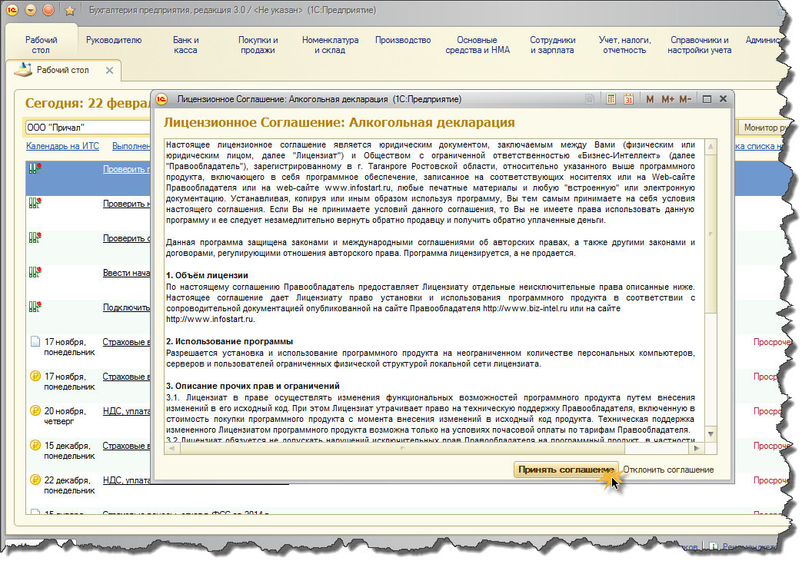
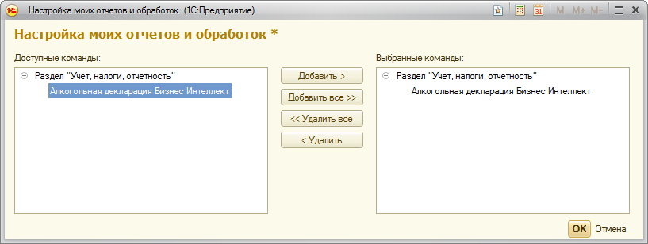

Регистрация продукта  в программе "1С:Бухгалтерия 8"
====================================================

Два варианта регистрации продукта
---------------------------------

Программный продукт алкогольная декларация для 1С, может быть зарегистрирован и использоваться в программе "1С:Бухгалтерия предприятия 8" в 2-х вариантах:

#. Регистрация в разделе "Учет, налоги, отчетность", команда "Дополнительный отчеты" подраздела "Отчеты" (Учет,налоги,отчетность -> Отчеты -> Дополнительные отчеты)
#. Регистрация в разделе "Регламентированные отчеты" (Учет, налоги, отчетность -> 1С:Отчетность -> Регламентированные отчеты)

Для того чтобы зарегистрировать продукт любым из вышеперечисленных способов необходимо выполнить следующее:

#. Перейти в **Главное меню -> Файл -> Открыть** и выбрать файл обработки "АлкогольнаяДекларацияДляБух30.epf".

.. figure:: _static/reg_0.png

2. При открытии файла Вы увидите окно с текстом лицензионного соглашения, которое необходимо принять.

Если Вы приняли условия лицензионного соглашения, Вам будет предложено выбрать один из двух вариантов регистрации продукта - "Режим внешнего отчета" (рекоммендуется) или "Режим регламентированного отчета".

Регистрация в качестве дополнительного отчета
---------------------------------------------

Это предпочтительный вариант регистрации продукта т.к. представляется нам наиболее удобным для работы пользователя. К тому же вариант "встраивания" отчета в подсистему регламентированных отчетов программы "1С:Бухгалтерия 8" имеет свои особенности реализации и поэтому, пока, находится в стадии beta-тестирования.

Регистрация произойдет автоматически при выборе пункта "Режим внешнего отчета" с последующим нажатием кнопки **"ОК"**
 
.. figure:: _static/reg_2.png

После завершения процедуры автоматическо регистрации на экране появится окно с соответсвующим сообщением. 

.. figure:: _static/reg_3.png

Суть сообщения в том, что обработка успешно зарегистрирована и получила "прописку" в разделе "Учет, налоги, отчетность", в подразделе "Дополнительные отчеты", откуда ее можно будет, при необходимости вызвать и пользоваться. Перейдем в соответсующий раздел.

.. figure:: _static/reg_4.png

И вызовем команду "Дополнительные отчеты".

Как видно на рисунке открылась пустая форма, где нет доступных для использования отчетов. Это не совсем так. Еще одно действие и можно будет работать. В левом нижнему углу есть комманда (в виде гиперссылки) **"Настроить список"**. Вызовем её.

Окно настройки списка состоит из 2-х полей списков. В левом списке доступные для использования отчеты, а в правой те что будут отображены системой 1С в списке дополнительных отчетов. Нам нужно добавить отчет Алкогольная декларация для 1С в правый список и нажеть **"ОК"**

 После чего отчет Алкогольная декларация появится в скиске дополнительных отчетов и может быть запущена по комманде **"Выполнить"** или двойным кликом мыши пользователя.
 
 .. figure:: _static/reg_8.png
 
 Далее перейдем к рассмотрению базовой концепции продукта - журнала алкогольных деклараций
 